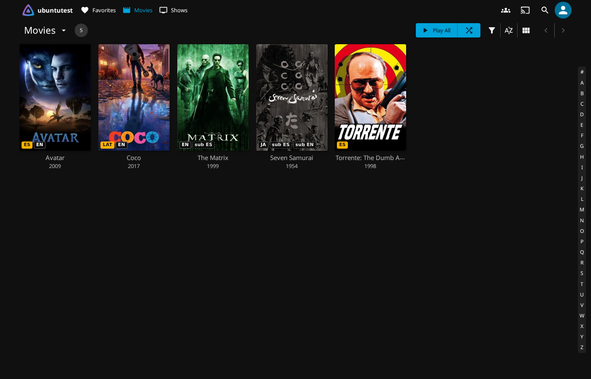
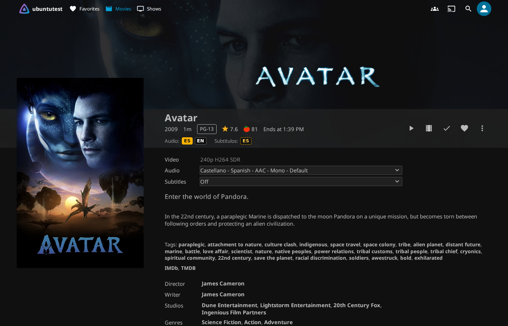
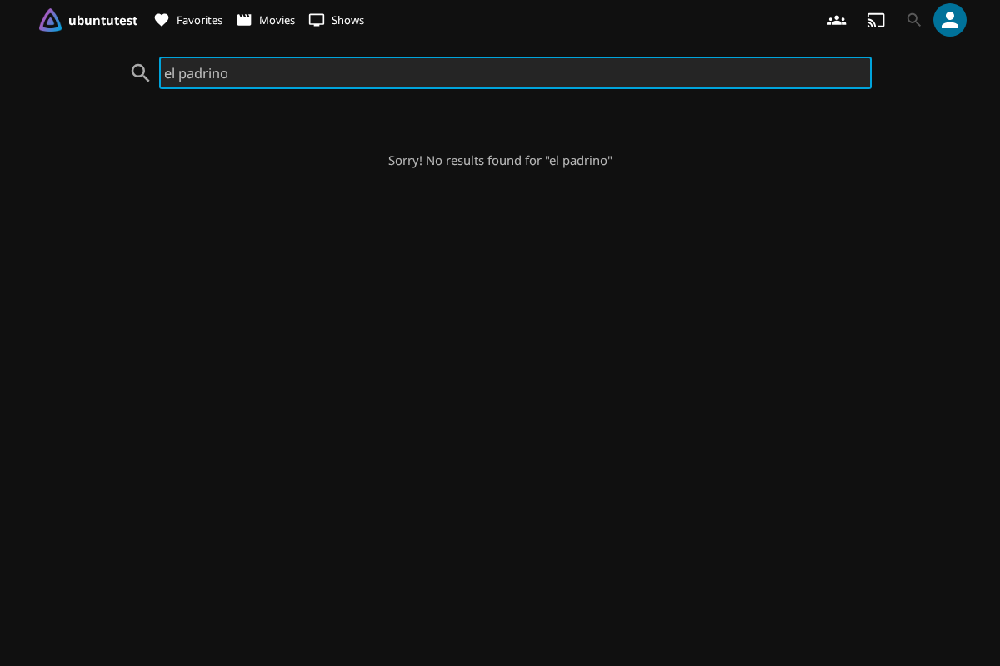
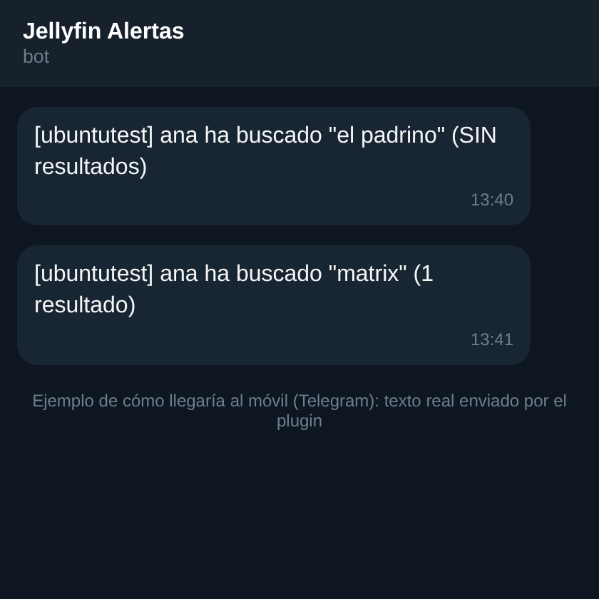
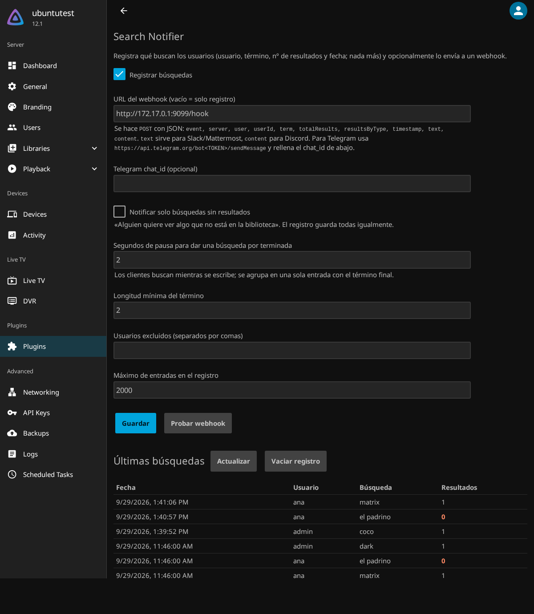

# Plugins de Jellyfin — luiscorbachoflores

Cuatro plugins independientes para Jellyfin (.NET 9 / `Jellyfin.Controller` 10.11.x; Language Badges y Search Notifier también compilan para Jellyfin 12.x / .NET 10). Los que llevan interfaz inyectan su propio script en `index.html` mediante un middleware ASP.NET Core en tiempo de respuesta — **sin modificar ningún fichero de jellyfin-web**.

## Instalación (repositorio de plugins)

En Jellyfin, ve a **Panel de control → Complementos → Repositorios** y añade:

```
https://github.com/luiscorbachoflores/jellyfin_plugins/raw/main/manifest.json
```

Instala **Reviews**, **JellyAsk**, **Language Badges** y/o **Search Notifier** desde el catálogo de complementos y reinicia Jellyfin.

## Reviews

Añade un bloque de reseñas de usuarios a la página de detalle de cada película o serie: valoración por estrellas en pasos de 0,5, comentario de texto y opción de publicar como usuario identificado de Jellyfin o de forma anónima.

- API REST propia (`GET/POST /Reviews/{itemId}`), almacenamiento SQLite.
- El modo "usuario" verifica el token de sesión en el servidor.

Código en [`src/Reviews`](src/Reviews).

## JellyAsk

Añade una entrada **"Pedir película"** al menú de navegación (justo encima de Ajustes). Abre un formulario con un único campo de texto libre ("Incluye todos los detalles posibles para que podamos encontrar la película"); al enviarlo, registra la petición en el **Activity Log nativo de Jellyfin** (Panel de control → Actividad), visible para cualquier plugin de notificaciones (p. ej. un notificador de Telegram) que escuche esos eventos.

- Requiere sesión Jellyfin válida (no admite modo anónimo).
- API REST propia (`POST /JellyAsk/Request`).

Código en [`src/JellyAsk`](src/JellyAsk).

## Language Badges

Muestra, de un vistazo, en qué idioma está cada película o serie: chips de **audio** (`ES`, `EN`, `LAT`, `JA`...) sobre el póster en biblioteca, inicio y búsqueda, y una línea **Audio / Subtítulos** en la ficha. Los idiomas que el usuario prefiere se resaltan en amarillo. Lee los `MediaStreams` ya analizados por Jellyfin (incluye versiones alternativas; las series agregan sus episodios).




- API: `GET /LanguageBadges/Items?ids=a,b,c` (token de usuario). Script cliente inyectado al servir `index.html` (`/LanguageBadges/client.js`).
- Las insignias solo aparecen en el cliente web de Jellyfin (no en apps nativas).
- Opciones en Panel → Plugins → Language Badges: idiomas destacados, subtítulos, series, máximo de chips.

Código en [`src/LanguageBadges`](src/LanguageBadges).

## Search Notifier

Avisa al admin cuando un usuario busca algo. Detecta cualquier petición con `searchTerm` (web, Android, Swiftfin, Kodi...), agrupa el "buscar mientras escribes" en una sola búsqueda y guarda **solo** usuario, término, nº de resultados y fecha. Opcionalmente envía un webhook JSON (`text` para Slack/Mattermost, `content` para Discord, o Telegram directo con `chat_id`). La opción "solo sin resultados" avisa de lo que alguien busca y no tienes.





- API admin: `GET/DELETE /SearchNotifier/Log`, `POST /SearchNotifier/TestWebhook`.
- Privacidad: se registran las búsquedas de los usuarios; conviene avisarles.

Código en [`src/SearchNotifier`](src/SearchNotifier).

## Desarrollo

Cada plugin es un proyecto .NET independiente:

```
cd src/Reviews   # o src/JellyAsk
dotnet build -c Release -o build
```

Para Language Badges y Search Notifier hay un script que genera los zips e `meta.json`: `scripts/build-new-plugins.sh [versionJellyfin] [dirPlugins]` (por defecto 10.11.8; p. ej. `12.1.0` para Jellyfin 12, con `targetAbi` acorde). Tests en [`tests/`](tests) (`setup_and_test.py`, `webhook_test.py`, `ui_screenshots.py`, `search_demo.py`).

El resultado en `build/` incluye el DLL del plugin y sus dependencias. Para desplegar manualmente, copia el contenido a `config/plugins/<Nombre>_<version>/` de tu instancia de Jellyfin.

## Compatibilidad

Reviews y JellyAsk: probados contra Jellyfin **10.11.11**. Language Badges y Search Notifier: probados en **10.11.8** y **12.1.0** (API y navegador headless). El anclaje visual usa clases del cliente web oficial (`.itemDetailPage`, `.overview-controls`, `.mainDrawer-scrollContainer`, `.btnSettings`); si una versión futura de Jellyfin cambia esa estructura, solo haría falta actualizar el JS correspondiente (`src/Reviews/wwwroot/reviews.js` o `src/JellyAsk/wwwroot/jellyask.js`), no el resto del plugin.
